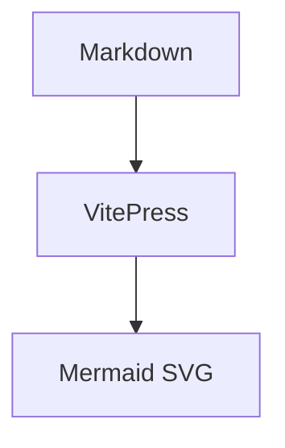

# @aether-labs/vitepress-mermaid

Zero-config Mermaid support for VitePress.

## Features

- Standard ````mermaid` fenced code blocks
- Client-first and SSR-safe rendering
- Lazy import of `mermaid`
- Dark mode re-rendering through VitePress `isDark`
- Error fallback with source display
- Does not override normal Shiki-powered code blocks
- CLI init for the closest possible “zero-config” setup

## Quick Start

```bash
pnpm add -D @aether-labs/vitepress-mermaid mermaid
pnpm exec aether-vitepress-mermaid init
```

Then write Mermaid in Markdown:

````md

````

## Manual Setup

Only `withMermaid` in config is required for Mermaid to work. The wrapper also registers the `MermaidDiagram` Vue component automatically.

`.vitepress/config.ts`:

```ts
import { defineConfig } from 'vitepress'
import { withMermaid } from '@aether-labs/vitepress-mermaid'

export default withMermaid(
  defineConfig({
    title: 'My Docs'
  })
)
```

`.vitepress/theme/index.ts` (optional — only needed if you want explicit theme-level control):

```ts
import DefaultTheme from 'vitepress/theme'
import { withMermaidTheme } from '@aether-labs/vitepress-mermaid/runtime'

export default withMermaidTheme(DefaultTheme)
```

`withMermaidTheme` is optional when you already use `withMermaid` in config. Use it if you prefer wiring the runtime in theme, or if you need to combine it with other `enhanceApp` customizations.

## Options

```ts
withMermaid(defineConfig({}), {
  markdown: {
    languages: ['mermaid'],
    defaultMeta: {
      showSource: false,
      interactive: false
    }
  }
})
```

Runtime options can be passed through `withMermaid` (recommended) or the theme layer:

```ts
withMermaid(defineConfig({}), {
  runtime: {
    securityLevel: 'strict',
    theme: {
      light: 'default',
      dark: 'dark'
    }
  }
})
```

Or via theme:

```ts
export default withMermaidTheme(DefaultTheme, {
  securityLevel: 'strict',
  theme: {
    light: 'default',
    dark: 'dark'
  }
})
```

## Fence Meta

````md

````

Supported in v0.1 skeleton:

- `title="..."`
- `showSource`
- `interactive`

## FAQ

### Why not work after install only?

VitePress does not auto-discover npm plugins. Run `pnpm exec aether-vitepress-mermaid init`, or manually wrap your config with `withMermaid`.

### Why do I see "Failed to resolve component: MermaidDiagram"?

This means the Markdown plugin is active (mermaid fences are being converted), but the Vue component was not registered. Ensure your `.vitepress/config.ts` uses `withMermaid(...)`. If you are on an older version, upgrade to the latest package — or add `withMermaidTheme` in `.vitepress/theme/index.ts` as shown in Manual Setup.

### Why client-first?

Mermaid rendering depends on browser DOM behavior. The package outputs `<ClientOnly>` by default and renders SVG after mount.

### Why is Mermaid a peer dependency?

The host project already controls its VitePress/Vue stack, and Mermaid versions change quickly. Keeping Mermaid as a peer dependency avoids duplicate installs and version conflicts.
