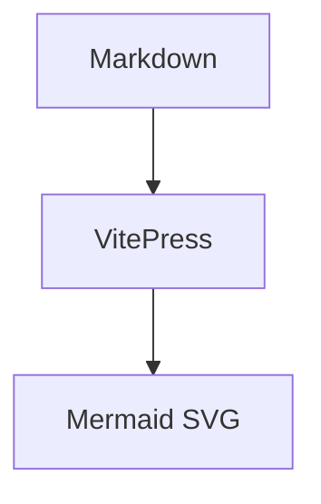

# VitePress Mermaid Playground


```mermaid title="基础流程" showSource
flowchart TD
  A[Markdown] --> B[VitePress]
  B --> C[Mermaid SVG]
```

```ts
const normalCodeBlock = 'should still be highlighted by VitePress/Shiki'
```
